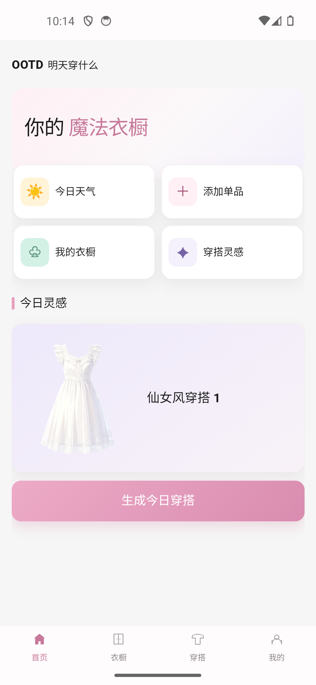
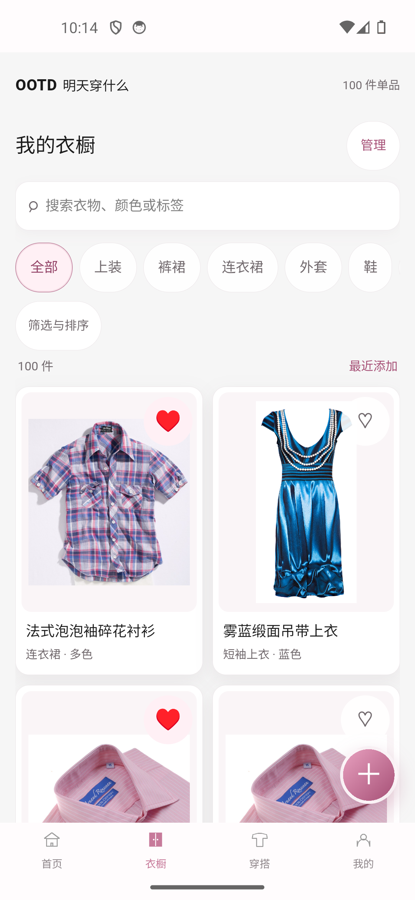
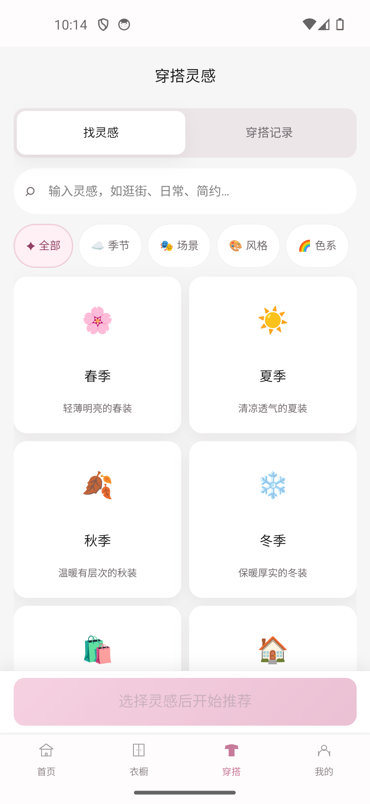
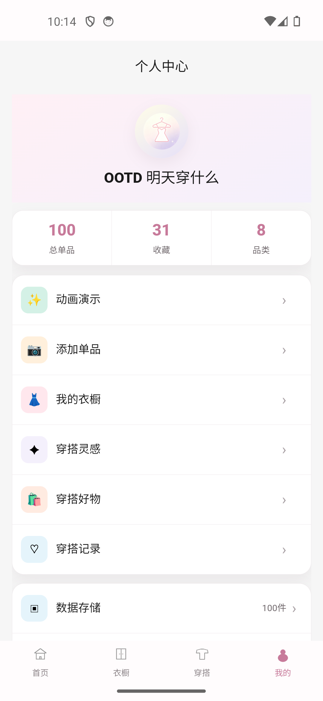

# 明天穿什么（OOTD）· Android 项目

简体中文 | **[English](README.md)**

这是「明天穿什么（OOTD）」最终版的 Android 可重建源码。界面和业务逻辑由 UniApp/Vue 3 实现，Android 原生壳负责 WebView、本地资源、相机、定位与系统分享桥接。

## 界面预览

| 首页 | 衣橱 | 穿搭灵感 | 个人中心 |
| --- | --- | --- | --- |
|  |  |  |  |

## 项目结构

- `uniapp/`：Vue 3 + UniApp 的页面、状态、领域逻辑、国际化、图片处理与测试。
- `app-shell/`：轻量 Android 原生壳（Java、Manifest、资源、应用图标与 APK 构建脚本）。
- `scripts/`：安装 APK、启动或停止 Android 模拟器的辅助脚本。
- `BUILD_AND_RUN.md`：环境变量、签名、构建、模拟器运行与故障排查说明。

## 已实现的主要功能

- 本地衣橱、拍照/相册导入、衣物识别辅助、分类与收藏管理。
- 天气定位、城市候选搜索、天气驱动穿搭建议。
- 场景与风格条件、三套推荐、喜欢/不喜欢、保存、已穿与记录批量管理。
- 主题、多语言、AI 助手配置、意见反馈、数据导入导出和本地诊断。

## 技术栈

| 层级 | 技术 |
| --- | --- |
| 前端 | Vue 3、TypeScript、UniApp、Pinia、Vue I18n、Vite |
| Android 壳 | Java、Android WebView、Android SDK Build Tools |
| 测试 | Vitest、vue-tsc |
| 最低 Android 版本 | Android 8.0（API 26） |
| 构建目标 | Android API 35 / Build Tools 35.0.0 |

## 快速开始

请先阅读 [BUILD_AND_RUN.md](BUILD_AND_RUN.md)。完成环境变量与签名配置后：

```powershell
cd uniapp
npm ci
npm run type-check
npm test -- --run

cd ..\app-shell
powershell -NoProfile -ExecutionPolicy Bypass -File .\build-preview.ps1
```

生成的 APK 位于 `app-shell/output/ootd-preview-0.1.10.apk`。该目录和签名文件默认被 `.gitignore` 忽略，不会上传到 GitHub。

也可以直接从 [Releases](https://github.com/openkaiwu/OOTD/releases) 下载现成的 APK（Android 8.0 及以上），无需任何构建环境。

## 安全与发布

- 不要提交 `*.keystore`、`.jks`、SDK、模拟器镜像、`node_modules`、`.env` 或生成的 APK。
- API Key 仅由用户在 APP 内输入并保存在本机；提交前仍应检查是否误提交任何测试密钥。
- 当前原生壳为本地签名验收构建。发布到应用商店前，应替换包名、应用签名、版本号、隐私政策、接口域名与发布渠道配置，并完成真机回归测试。
